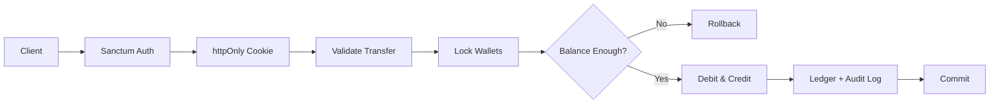
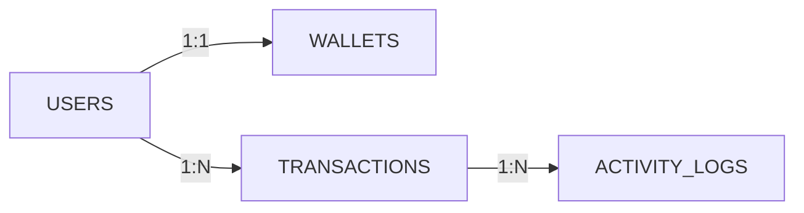

# Mini Wallet — Slide Presentation Deck (12-Slide Format)
**Full Stack Web Development Bootcamp Take-Home Test**  
**Presenter:** Julio Rohmatulloh Hardiansyah ([GitHub: AzerothGT](https://github.com/azerothgt) | [LinkedIn: azerothgt](https://www.linkedin.com/in/azerothgt))  
**Repository:** [github.com/AzerothGT/miniwallet](https://github.com/AzerothGT/miniwallet)

---

### **Slide 1: Cover / Title**
* **Header / Category**: Case — Digital Wallet & Financial Transaction System (Mini Wallet)
* **Main Title**: Full Stack Web Developer
* **Subtitle**: *Mini Wallet API & Interactive Dashboard — A High-Integrity Digital Wallet System with Sanctum Authentication, Concurrency Locking, and an Integrated Audit Trail.*

---

### **Slide 2: My Journey as a Developer**
* **Title**: My Journey as a Developer
* **Description**:
  > Welcome! I’m **Julio Rohmatulloh Hardiansyah**, a Full-Stack Web Developer with a strong passion for IT, financial technology architectures, and software engineering. I constantly explore emerging web standards and love turning complex backend requirements into secure, robust, and delightful user experiences.
* **Links**:
  * GitHub: [github.com/azerothgt](https://github.com/azerothgt)
  * LinkedIn: [linkedin.com/in/azerothgt](https://www.linkedin.com/in/azerothgt)

---

### **Slide 3: Web-Based View**
* **Title**: Web-Based View
* **CLIENT VIEW (User SPA)**:
  * Responsive design: Mobile-first (floating bottom bar) & Desktop 2-column layout (fixed sidebar).
  * Interactive balance card, **Quick Send** feature based on transaction history, and a dedicated numeric keypad (prevents non-digit input).
  * Complete transaction history (pagination & direction filter) along with a 7-day chart visualization.
* **ADMIN VIEW (Back-Office Dashboard)**:
  * Platform summary statistics (total circulating balance, active users, transaction volume).
  * Account management (search, suspension, and role changes).
  * Global transaction ledger and append-only audit trail (*Audit Logs*).

---

### **Slide 4: Problem Statement**
* **Title**: Problem Statement
* **Financial & Digital Wallet Challenges**:
  1. **Race Conditions & Double Spending**: Parallel transfer requests may read the same initial balance, potentially causing the balance to become negative.
  2. **Credential Theft (XSS)**: Storing auth tokens in `localStorage` makes them vulnerable to malicious scripts.
  3. **Monetary Value Inaccuracy (Float Inaccuracy)**: Using floats/decimals can cause rounding discrepancies down to the cent.
  4. **Disconnected & Tamper-Prone Audit Trails**: Logs recorded outside the DB transaction can become desynchronized during rollbacks or may be deleted.
  5. **User Privacy Leakage**: Exposing the sender’s contact information (email/phone number) to the recipient in incoming transaction history.

---

### **Slide 5: Target User & Value Proposition**
* **Title**: Target User & Value Proposition
* **TARGET USERS (CLIENT)**:
  * Error-free input (numeric keypad accepts whole numbers only).
  * Instant transfers & Quick Send shortcuts via email/phone number.
  * Protected privacy (sender identity is not exposed in incoming transaction history).
  * Financial transparency through real-time history and a 7-day summary.
* **OPERATOR / AUDITOR (ADMIN)**:
  * Absolute integrity: Paired dual-entry ledger with consistent UUIDs.
  * Append-only audit trail: Recorded within a single DB transaction and cannot be edited or deleted.
  * Risk control: Instantly suspend problematic accounts.
  * Real-time monitoring: Money circulation and transaction volume metrics.

---

### **Slide 6: Business Model**
* **Title**: Business Model
* **Model**: B2C Digital Wallet Operations Platform + B2B / Internal Administration.
* **B2C (Consumer Digital Wallet)**: Personal digital wallet service for instant balance top-ups, real-time peer-to-peer transfers, and daily spending monitoring.
* **B2B / Back-Office Control**: Internal control system for financial compliance, fraud mitigation through user suspension, and audit-trail reconciliation for operational accountability.

---

### **Slide 7: Impact & Scalability**
* **Title**: Impact & Scalability
* **IMPACT**:
  * **Zero Balance Mismatch**: ACID transactions + row locking ensure that balances never become negative.
  * **XSS-Immune Authentication**: Sanctum tokens are securely isolated in `httpOnly` cookies.
  * **Guaranteed Auditability**: Activity logs are recorded atomically within the same transaction; if a transfer rolls back, the log rolls back as well.
  * **High Reliability**: 103 automated tests (438 assertions) executed directly against real MySQL.
* **SCALABILITY**:
  * **Stateless RESTful Architecture**: Enables easy scale-out of the Laravel backend behind a Load Balancer.
  * **Read/Write DB Separation**: Master DB for transaction execution; Read Replicas for history and reporting queries.
  * **Queue Integration Ready**: Ready to connect to a Message Queue (Redis / RabbitMQ).
  * **Domain-Driven Boundary**: `WalletService` is isolated as the sole domain responsible for balance mutations.

---

### **Slide 8: Tech Stack Overview**
* **Title**: Tech Stack Overview
* **React 19 + Vite 8 (Frontend Framework)**:
  * Ultra-fast build performance, Tailwind CSS v4 (CSS `@theme` configuration), Phosphor Icons, and Storybook 10 (85 component stories).
* **Laravel 13 - PHP 8.3+ (Backend REST API)**:
  * Sanctum authentication (hybrid token + `httpOnly` cookie), automatic OpenAPI 3.1 via Scramble (`/docs/api`), Pest 5 testing, and Larastan level 7.
* **MySQL 8 (Relational Database)**:
  * ACID transactions, pessimistic row locking (`lockForUpdate()`), and precise integer `bigint` values for whole Rupiah amounts without floats.

---

### **Slide 9: System Architecture**
* **Title**: System Architecture
* **Backend Code Structure (`miniwallet-be`)**:
  ```
  app/
  ├── Enums/            # ActivityCategory, ActivityEvent, TransactionType, UserRole
  ├── Exceptions/       # BusinessRuleException (insufficient_balance, etc.)
  ├── Http/
  │   ├── Controllers/  # Api/ (Auth, Wallet, Tx) & Api/Admin/ (Stats, Logs)
  │   ├── Middleware/   # AuthenticateFromCookie, EnsureAdmin, EnsureNotSuspended
  │   ├── Requests/     # AmountRequest, RegisterRequest, etc.
  │   └── Resources/    # Safe JSON response shape, counterpart privacy
  ├── Models/           # User, Wallet, Transaction, ActivityLog (append-only)
  └── Services/         # WalletService (lock & tx), ActivityLogger, AuthCookieFactory
  ```
* **Architecture Flow**:
  `React SPA` *(httpOnly cookie)* ➔ `Laravel API` ➔ `AuthenticateFromCookie Middleware` *(cookie to Bearer header)* ➔ `auth:sanctum` ➔ `WalletService` *(DB Transaction + Row Lock)* ➔ `MySQL 8`.

---

### **Slide 10: Use Case — Auth & Transaction Flow**
* **Title**: Use Case — Auth & Transaction Flow



---

### **Slide 11: Database Design**
* **Title**: Database Design



---

### **Slide 12: Challenge, Solution & Wrap-Up**
* **Title**: Challenge & Solution — Wrap-Up
* **Challenges & Solutions**:
  1. *Race Condition / Double Spending* ➔ **Pessimistic Locking (`lockForUpdate()`)** with consistent ID ordering in `DB::transaction`.
  2. *XSS Risk from Tokens* ➔ **`httpOnly` Cookie** + `AuthenticateFromCookie` Middleware.
  3. *Monetary Integrity & Audit Trail* ➔ **Integer `bigint` Rupiah**, non-fillable balance field, and audit logs created within the same transaction.
* **Tools**: Git/GitHub monorepo, React 19 + Tailwind v4, Storybook 10 (85 stories), Pest 5 (103 tests, 438 assertions on MySQL).
* **Demo Accounts (Password: `password123`)**:
  * `ian@example.com` (Rp 435,000) | `budi@example.com` (Rp 300,000) | `citra@example.com` (Rp 115,000) | `admin@example.com` (Super Admin)
  * Repo: [github.com/AzerothGT/miniwallet](https://github.com/AzerothGT/miniwallet) | Docs: `/docs/api`
