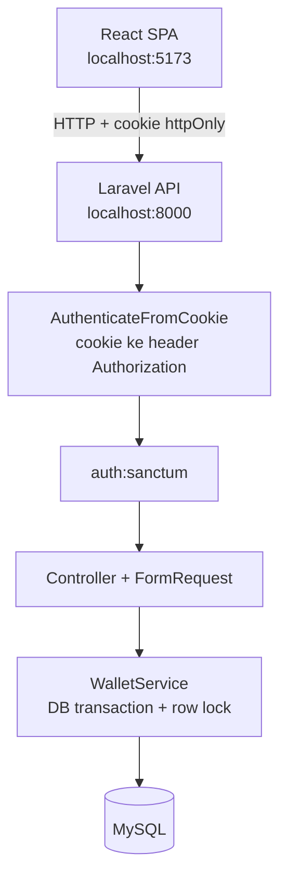
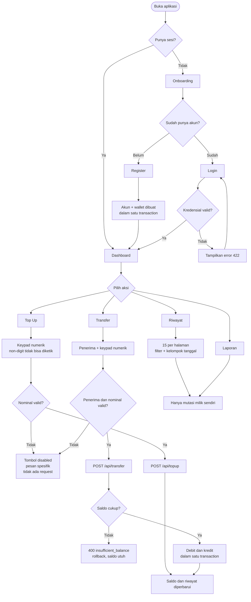

# Mini Wallet

Mini Wallet API & Dashboard — sistem wallet sederhana dengan autentikasi Sanctum, top up, transfer antar user, dan riwayat mutasi.

Dibangun sebagai Take Home Test Full Stack Web Development Bootcamp.

## Struktur Repository

```
miniwallet-be/    Laravel 13 REST API (Sanctum, MySQL, Swagger)
miniwallet-fe/    React 19 SPA (Vite, React Router, Axios)
```

Masing-masing folder punya README sendiri dengan detail lengkap:

- [`miniwallet-be/README.md`](miniwallet-be/README.md) — ERD, endpoint, strategi token, integritas transaksional, kontrak error
- [`miniwallet-fe/README.md`](miniwallet-fe/README.md) — halaman, error handling, pencegahan double submit, aksesibilitas

## Tech Stack

| Layer | Pilihan |
| --- | --- |
| Backend | Laravel 13, PHP 8.3+ |
| Autentikasi | Laravel Sanctum (token di cookie httpOnly) |
| Database | MySQL 8 |
| API Docs | Scramble (OpenAPI 3.1) di `/docs/api` |
| Frontend | React 19, Vite 8, Tailwind CSS v4, React Router 7, Axios |
| Ikon | Phosphor Icons |
| Component workshop | Storybook 10 (85 story) |
| Testing | Pest 5 (103 test, 438 assertion) |
| Static analysis | Larastan / PHPStan level 7 |
| Code style | Laravel Pint, oxlint |

## Arsitektur



Semua perpindahan uang melewati `WalletService`, satu-satunya tempat yang boleh mengubah saldo. Controller hanya memvalidasi dan menyusun response.

## Alur Pengguna



## Cara Run

Prasyarat: PHP 8.3+, Composer, MySQL 8, Node.js 20+.

### 1. Backend

```bash
cd miniwallet-be
composer install
cp .env.example .env
php artisan key:generate
```

Buat database, lalu sesuaikan `DB_USERNAME` / `DB_PASSWORD` di `.env`:

```bash
mysql -u root -e "CREATE DATABASE miniwallet CHARACTER SET utf8mb4 COLLATE utf8mb4_unicode_ci;"
mysql -u root -e "CREATE DATABASE miniwallet_test CHARACTER SET utf8mb4 COLLATE utf8mb4_unicode_ci;"
```

```bash
php artisan migrate --seed
php artisan serve
```

API di `http://localhost:8000`, dokumentasi Swagger di `http://localhost:8000/docs/api`.

### 2. Frontend

```bash
cd miniwallet-fe
npm install
cp .env.example .env
npm run dev
```

Dashboard di `http://localhost:5173`.

Untuk memeriksa komponen secara terisolasi:

```bash
npm run storybook
```

### Akun demo

Password untuk semua akun: `password123`

| Nama | Email | Peran | Saldo |
| --- | --- | --- | --- |
| Ian Pratama | ian@example.com | Pengguna | Rp 435.000 |
| Budi Santoso | budi@example.com | Pengguna | Rp 300.000 |
| Citra Dewi | citra@example.com | Pengguna | Rp 115.000 |
| Super Admin | admin@example.com | Administrator | Rp 0 |

Untuk deployment sungguhan, administrator dapat dibuat sendiri tanpa akun demo:

```bash
php artisan db:seed --class=AdminSeeder
```

Seeder itu idempoten dan mengambil kredensial dari environment (`ADMIN_EMAIL`,
`ADMIN_PASSWORD`, dan seterusnya). Detailnya ada di
[`miniwallet-be/README.md`](miniwallet-be/README.md).

## Endpoint

| Method | Path | Auth | Keterangan |
| --- | --- | --- | --- |
| POST | `/api/register` | – | Daftar akun, otomatis membuat wallet |
| POST | `/api/login` | – | Login, mengembalikan Sanctum token |
| GET | `/api/me` | ✓ | Profil user yang sedang login |
| POST | `/api/logout` | ✓ | Cabut token yang sedang dipakai |
| GET | `/api/wallet` | ✓ | Saldo saat ini |
| POST | `/api/topup` | ✓ | Tambah saldo |
| POST | `/api/transfer` | ✓ | Kirim saldo ke user lain (email / nomor HP) |
| GET | `/api/transactions` | ✓ | Riwayat mutasi (masuk & keluar) |
| GET | `/api/admin/stats` | admin | Statistik platform |
| GET | `/api/admin/users` | admin | Daftar pengguna, cari & filter |
| PATCH | `/api/admin/users/{user}/suspension` | admin | Nonaktifkan / aktifkan akun |
| PATCH | `/api/admin/users/{user}/role` | admin | Ubah peran akun |
| GET | `/api/admin/transactions` | admin | Ledger seluruh platform |
| GET | `/api/admin/logs` | admin | Jejak aktivitas, append-only |
| GET | `/api/admin/logs/filters` | admin | Pilihan kategori dan jenis kejadian |

## Layar Frontend

| Route | Akses | Isi |
| --- | --- | --- |
| `/` | guest | Onboarding |
| `/login`, `/register` | guest | Autentikasi |
| `/dashboard` | terautentikasi | Saldo, kirim cepat, transaksi terakhir |
| `/topup`, `/transfer` | terautentikasi | Keypad numerik |
| `/history` | terautentikasi | Riwayat penuh dengan paginasi dan filter |
| `/report` | terautentikasi | Ringkasan dan grafik 7 hari |
| `/profile` | terautentikasi | Info akun dan logout |
| `/admin` | admin | Ringkasan platform |
| `/admin/users` | admin | Kelola pengguna |
| `/admin/transactions` | admin | Ledger seluruh transaksi |
| `/admin/logs` | admin | Jejak aktivitas |

Setiap layar punya dua komposisi: satu kolom dengan navigasi mengambang di bawah `lg`, dan dua kolom dengan sidebar menetap dari `lg` ke atas.

## Keputusan Teknis Utama

**Uang sebagai integer.** Saldo disimpan `bigint` rupiah bulat, bukan `float`. Aritmetika floating point tidak eksak, dan requirement memang meminta nominal hanya bilangan bulat.

**Satu baris per sisi mutasi.** Transfer menghasilkan dua baris `transactions` dengan `reference` UUID yang sama (`transfer_out` dan `transfer_in`). Akibatnya `GET /api/transactions` cukup memfilter `user_id`, sehingga isolasi antar user menjadi sifat skema, bukan filter yang bisa lupa ditulis.

**Row lock dengan urutan tetap.** `lockForUpdate()` diurutkan berdasarkan `id` wallet. Tanpa lock, dua request paralel bisa membaca saldo awal yang sama dan lolos pemeriksaan sehingga saldo minus. Tanpa urutan tetap, A→B bersamaan dengan B→A bisa deadlock.

**Token di cookie httpOnly.** Token Sanctum dikembalikan di response body (untuk API client dan Swagger) sekaligus dipasang sebagai cookie httpOnly (untuk browser). Middleware menyalin cookie ke header `Authorization`; header eksplisit selalu menang. JavaScript tidak pernah menyentuh token, jadi XSS tidak punya cara mengambilnya.

**400 dipisahkan dari 422.** 422 berarti bentuk request salah, 400 berarti request benar tapi tidak bisa dijalankan (saldo tidak cukup, penerima tidak ada, transfer ke diri sendiri). Frontend memanfaatkannya: 422 menempel ke field, 400 jadi banner.

**Alamat penerima hanya dibuka satu arah.** Field `counterpart.transfer_target` berisi alamat tujuan pada transfer keluar, tetapi `null` pada transfer masuk. Pada transfer keluar, alamat itu dulu diketikkan sendiri oleh user sehingga mengembalikannya tidak memberi informasi baru — dan memungkinkan fitur "kirim lagi" tanpa mengetik ulang. Pada transfer masuk, mengembalikannya berarti membocorkan email atau nomor HP pengirim kepada orang yang mungkin belum pernah mengetahuinya.

**Jejak audit ditulis dari dalam transaksi yang sama.** Entri log untuk top up dan transfer dibuat di dalam `DB::transaction` yang memindahkan uangnya. Itu yang membuat jejaknya bisa dipercaya: uang tidak bisa berpindah tanpa tercatat, dan catatan tidak bisa bertahan dari perpindahan yang di-rollback. Tabelnya append-only — tidak ada kolom `updated_at`, tidak ada endpoint tulis, dan model menolak update maupun delete.

**Test di MySQL, bukan SQLite.** Suite ini menguji rollback dan row locking, yang tidak dimodelkan sama oleh SQLite in-memory.

## Testing

```bash
cd miniwallet-be
composer test          # Pint + PHPStan + Pest
composer types:check   # PHPStan level 7
```

```bash
cd miniwallet-fe
npm run lint
npm run build
npm run build-storybook
```

Cakupan test yang penting:

- Register menolak email `user@`, password < 8 karakter, username duplikat.
- Login memberi pesan identik untuk email tidak dikenal dan password salah, agar akun tidak bisa dienumerasi.
- Token dari cookie httpOnly mengautentikasi request tanpa header `Authorization`.
- Sembilan variasi nominal tidak valid pada top up dan transfer, masing-masing memverifikasi saldo tidak berubah dan tidak ada baris transaksi tercipta.
- Kegagalan di tengah transfer mengembalikan saldo pengirim (uji rollback eksplisit).
- User A tidak dapat melihat mutasi User B.
- Alamat penerima dikembalikan pada transfer keluar, tetapi email dan nomor HP pengirim tidak muncul di field mana pun pada transfer masuk.
