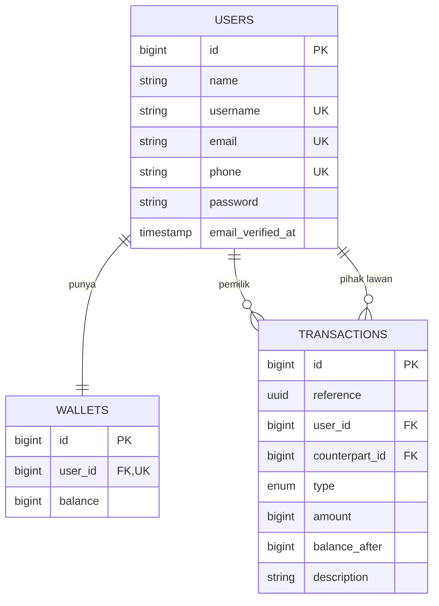

# Mini Wallet API

REST API untuk Mini Wallet: autentikasi Sanctum, top up, transfer antar user, dan riwayat mutasi.

Frontend SPA-nya ada di repo terpisah: `miniwallet-fe`.

## Tech Stack

| Bagian | Pilihan |
| --- | --- |
| Framework | Laravel 13 (PHP 8.3+) |
| Autentikasi | Laravel Sanctum (personal access token) |
| Database | MySQL 8 |
| API Docs | Scramble (OpenAPI 3.1 + Stoplight Elements) |
| Testing | Pest 5 |
| Static analysis | Larastan (PHPStan level 7) |
| Code style | Laravel Pint |

## ERD



### Kenapa satu baris per sisi mutasi

Tabel `transactions` menyimpan **satu baris untuk setiap sisi** perpindahan uang:

- Top up menghasilkan 1 baris `topup`.
- Transfer menghasilkan 2 baris dengan `reference` UUID yang sama: `transfer_out` untuk pengirim dan `transfer_in` untuk penerima.

Konsekuensinya, `GET /api/transactions` cukup memfilter `user_id = auth()->id()`. Isolasi antar user jadi sifat bawaan skema, bukan filter yang bisa lupa ditulis. Kolom `balance_after` menyimpan saldo setelah setiap mutasi sebagai jejak audit.

Saldo disimpan sebagai `bigint` rupiah bulat (tanpa sen) agar aritmetikanya eksak dan sejalan dengan aturan "nominal hanya boleh bilangan bulat". Tidak ada `float` di jalur uang.

## Cara Run

Prasyarat: PHP 8.3+, Composer, MySQL 8.

```bash
# 1. Dependency
composer install

# 2. Environment
cp .env.example .env
php artisan key:generate

# 3. Database
mysql -u root -e "CREATE DATABASE miniwallet CHARACTER SET utf8mb4 COLLATE utf8mb4_unicode_ci;"
mysql -u root -e "CREATE DATABASE miniwallet_test CHARACTER SET utf8mb4 COLLATE utf8mb4_unicode_ci;"
```

Sesuaikan `DB_USERNAME` dan `DB_PASSWORD` di `.env`, lalu:

```bash
php artisan migrate --seed
php artisan serve
```

API jalan di `http://localhost:8000`, dokumentasi di `http://localhost:8000/docs/api`.

### Akun demo

Seeder membuat tiga akun, semuanya dengan password `password123`:

| Nama | Email | Nomor HP | Saldo |
| --- | --- | --- | --- |
| Ian Pratama | ian@example.com | 081200000001 | Rp 435.000 |
| Budi Santoso | budi@example.com | 081200000002 | Rp 300.000 |
| Citra Dewi | citra@example.com | 081200000003 | Rp 115.000 |

## Endpoint

| Method | Path | Auth | Keterangan |
| --- | --- | --- | --- |
| POST | `/api/register` | – | Daftar akun, otomatis membuat wallet |
| POST | `/api/login` | – | Login, mengembalikan token |
| GET | `/api/me` | ✓ | Profil user yang sedang login |
| POST | `/api/logout` | ✓ | Cabut token yang sedang dipakai |
| GET | `/api/wallet` | ✓ | Saldo saat ini |
| POST | `/api/topup` | ✓ | Tambah saldo |
| POST | `/api/transfer` | ✓ | Kirim saldo ke user lain |
| GET | `/api/transactions` | ✓ | Riwayat mutasi (masuk & keluar) |

Endpoint `register` dan `login` dibatasi 10 request per menit per IP.

## Dokumentasi API

Scramble membaca signature controller, FormRequest, dan JsonResource untuk menghasilkan spec OpenAPI, jadi dokumentasi tidak bisa basi terhadap kode.

- UI interaktif: `/docs/api`
- Spec mentah: `/docs/api.json`
- Export ke file: `php artisan scramble:export` (menghasilkan `api.json`, tidak di-commit)

Untuk mencoba endpoint terproteksi dari UI: login lewat `POST /api/login`, salin nilai `token`, lalu tekan **Authorize**.

## Strategi Penyimpanan Token

Login mengembalikan Sanctum token di **dua** tempat:

1. **Response body** — untuk API client dan tombol "Try it" di halaman docs.
2. **Cookie `httpOnly`** — untuk browser SPA.

Middleware `AuthenticateFromCookie` menyalin token dari cookie ke header `Authorization` sebelum `auth:sanctum` berjalan:

```php
if (! $request->bearerToken()) {
    $token = $request->cookie(config('auth_cookie.name'));

    if (is_string($token) && $token !== '') {
        $request->headers->set('Authorization', 'Bearer '.$token);
    }
}
```

Alasan pendekatan ini:

- **Tahan XSS.** Token tidak pernah masuk `localStorage` dan tidak bisa dibaca JavaScript, jadi script yang tersuntik tidak punya cara mengambilnya.
- **Tetap token Sanctum asli.** Requirement "menghasilkan Sanctum Token" terpenuhi; ini bukan session-based SPA mode.
- **Header selalu menang.** Kalau `Authorization` sudah ada, cookie diabaikan. Ini yang membuat Swagger tetap bisa dipakai, dan frontend bisa pindah ke bearer token tanpa mengubah backend sama sekali.

Catatan deployment: kalau API dan SPA berada di domain berbeda, cookie menjadi third-party sehingga butuh `AUTH_COOKIE_SAME_SITE=none` dan `AUTH_COOKIE_SECURE=true`. Cara yang lebih tahan lama adalah menempatkan keduanya di satu origin lewat proxy/rewrite.

## Integritas Transaksional

Transfer dijalankan di dalam satu database transaction dengan kedua baris wallet dikunci lebih dulu:

```php
$wallets = Wallet::query()
    ->whereIn('id', [$senderWalletId, $recipientWalletId])
    ->orderBy('id')          // urutan konsisten -> tidak deadlock
    ->lockForUpdate()        // baris terkunci -> tidak ada race condition
    ->get()
    ->keyBy('user_id');
```

Tiga hal yang dijaga di sini:

1. **`lockForUpdate()`** — tanpa ini, dua request paralel bisa sama-sama membaca saldo awal yang sama dan lolos dari pemeriksaan `if`, sehingga saldo bisa minus meskipun kodenya "terlihat" benar.
2. **Urutan lock berdasarkan `id`** — mencegah deadlock ketika A transfer ke B bersamaan dengan B transfer ke A.
3. **Rollback otomatis** — jika ada statement yang gagal setelah saldo pengirim terpotong, seluruh transaksi dibatalkan. Perilaku ini diuji eksplisit di `tests/Feature/TransferTest.php`.

`balance` juga sengaja tidak masuk daftar `fillable` pada model `Wallet`, jadi tidak ada controller atau mass-assignment yang bisa menggeser saldo tanpa lewat `WalletService`.

## Kontrak Error

| Status | Kapan | Contoh body |
| --- | --- | --- |
| `400` | Format valid, aturan bisnis dilanggar | `{"message":"Saldo tidak cukup...","code":"insufficient_balance","shortfall":8565000}` |
| `401` | Token tidak ada / tidak valid / dicabut | `{"message":"Anda harus login...","code":"unauthenticated"}` |
| `422` | Input gagal validasi | `{"message":"Nominal harus berupa angka.","errors":{"amount":["Nominal harus berupa angka."]}}` |

Pemisahan 400 dan 422 ini disengaja: 422 berarti "bentuk request-nya salah", 400 berarti "request-nya benar tapi tidak bisa dijalankan". Frontend memanfaatkannya dengan menempelkan 422 ke field masing-masing dan menampilkan 400 sebagai banner.

### Pesan validasi nominal

| Input | Pesan |
| --- | --- |
| `""` / tidak dikirim | Nominal tidak boleh kosong. |
| `abc`, `50.000!`, `1.000`, `1500.75` | Nominal harus berupa angka. |
| `-50000`, `0` | Nominal minimal Rp 1.000. |
| `999999999` | Nominal melebihi batas maksimum transaksi. |

Rule `integer` dipakai, bukan `numeric`, supaya `1.5` ikut ditolak. Modifier `bail` memastikan hanya satu pesan yang muncul per field. Batas nominal ada di `config/wallet.php`.

Semua input tidak valid dijawab tanpa menulis apa pun ke database — hal ini diuji lewat assertion saldo dan `assertDatabaseCount('transactions', 0)`.

## Testing

```bash
composer test          # Pint + PHPStan + Pest
php artisan test       # hanya Pest
composer lint          # perbaiki style
composer types:check   # PHPStan level 7
```

48 test, 185 assertion. Test suite berjalan di MySQL (`miniwallet_test`), bukan SQLite in-memory, karena yang diuji mencakup perilaku transaksi dan row locking yang tidak dimodelkan sama oleh SQLite.

Cakupan yang penting:

- Register menolak email `user@`, password < 8 karakter, dan username duplikat.
- Login gagal memberi pesan sama untuk email tidak dikenal dan password salah, agar akun tidak bisa dienumerasi.
- Token dari cookie `httpOnly` bisa mengautentikasi request tanpa header `Authorization`.
- Logout mencabut token, dan token yang dicabut langsung tidak berlaku.
- Sembilan variasi nominal tidak valid pada top up dan transfer, masing-masing memverifikasi saldo tidak berubah dan tidak ada baris transaksi tercipta.
- Saldo tidak cukup, transfer ke diri sendiri, dan penerima tidak ditemukan menghasilkan 400 dengan `code` yang spesifik.
- Kegagalan di tengah transfer mengembalikan saldo pengirim (uji rollback).
- User A tidak melihat mutasi User B.

## Struktur

```
app/
  Enums/TransactionType.php          # topup | transfer_in | transfer_out
  Exceptions/                        # BusinessRuleException + turunannya (400)
  Http/
    Controllers/Api/                 # Auth, Wallet, Transaction
    Middleware/AuthenticateFromCookie.php
    Requests/                        # AmountRequest sebagai basis Topup & Transfer
    Resources/                       # bentuk response JSON
  Models/                            # User, Wallet, Transaction
  Services/
    WalletService.php                # satu-satunya tempat uang berpindah
    AuthCookieFactory.php
config/
  auth_cookie.php                    # konfigurasi cookie httpOnly
  wallet.php                         # batas nominal
```

Logika uang sengaja dikumpulkan di `WalletService` supaya aturannya berlaku sama dari mana pun dipanggil (controller, command, seeder) dan bisa diuji tanpa HTTP.
